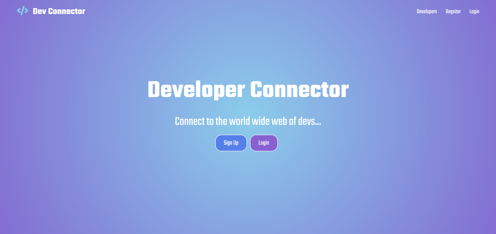

# Dev Connector

A MERN Stack Web Application designed to mimic a social media website. This project was made to enhance my understanding of React.js and back end server management. 

## Live Link
[Dev-Connector](https://agile-plains-50917.herokuapp.com/)

## Quick Start Guide

Need to establish a default.json file in config folder with:
Mongo database, github api token. json web token.

```bash
{
"mongoURI": "example.database",
"jwtSecret": "example secret",
"githubToken": "example.key"
}
```

## Usage

```bash
npm install

npm run dev
```

## Contributing
Pull requests are welcome. For major changes, please open an issue first to discuss what you would like to change.